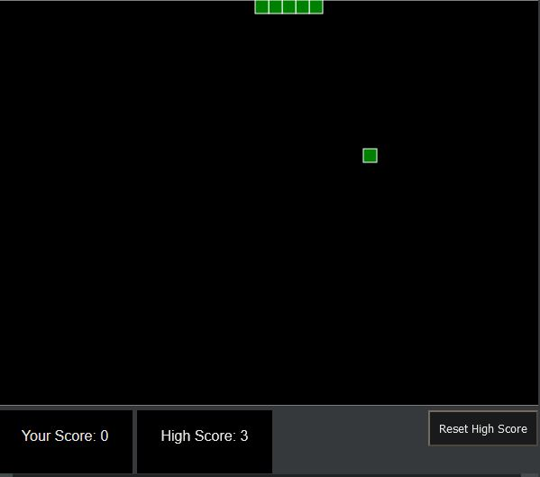
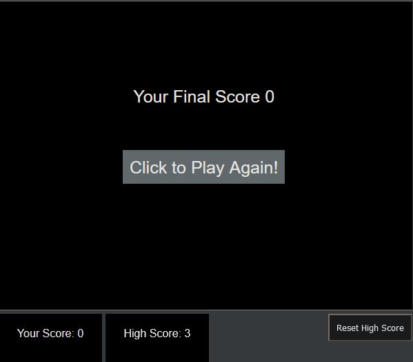

# Snake Game

This snake game is purely made with JavaScript. Some amount of Jquerry is used. The canvass element of HTML is used to make the canvass.

## GamePlay Screen

## Game Over Screen

## Game Play Demonstration

## Description

A desktop snake game which runs on any browser.(Recommended mozilla firefox or google chrome)  
Rules and features of this game:-  
1) Use arrow keys to move the snake. 
2) Eating each food will increase the score by 1.  
3) Crashing with the wall will end the game and will show the final score in the screen. Click play again button to restart the game.  
4) The high score will be recorded. The high score can be reset to 0 by clicking the 'Reset High Score Button'

## Code snippets of this game

  

### Happy Gaming😄😄😄!!!
